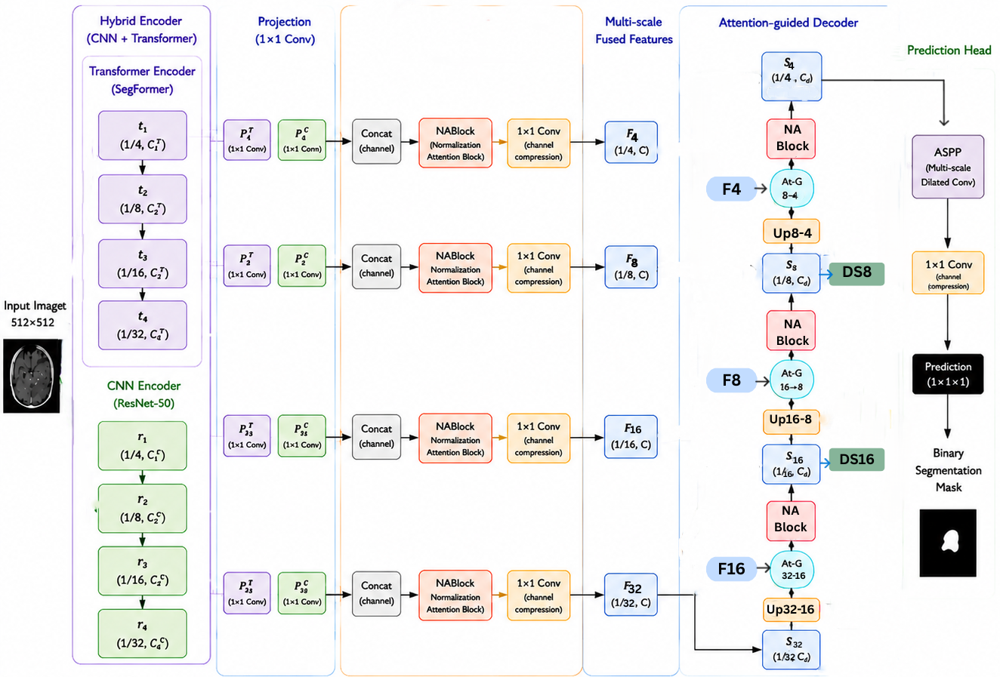
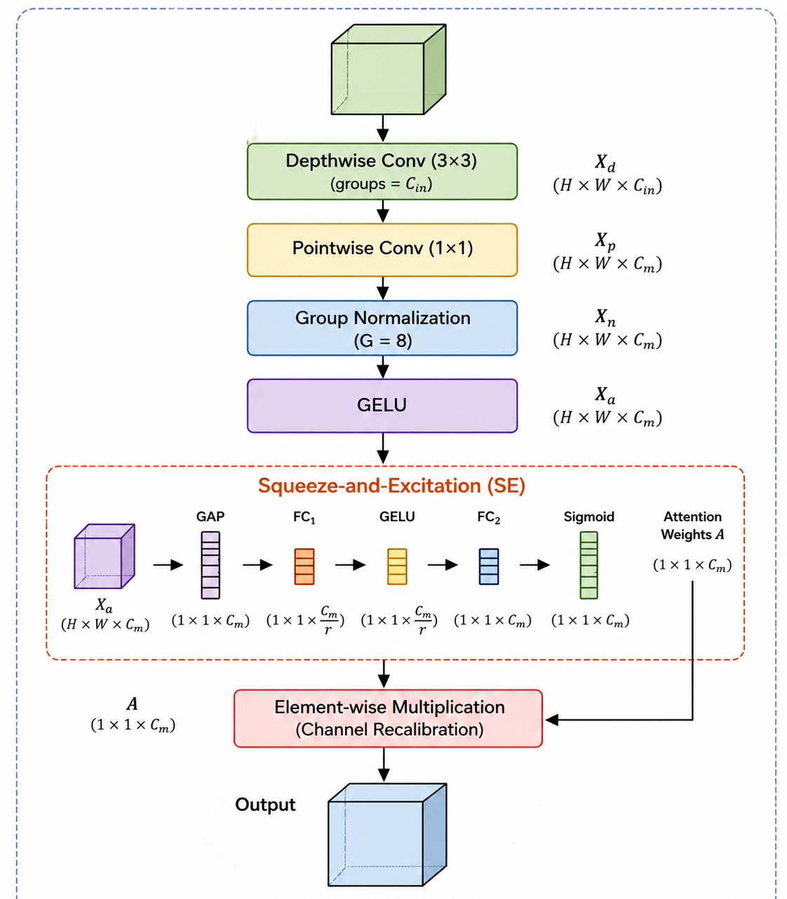
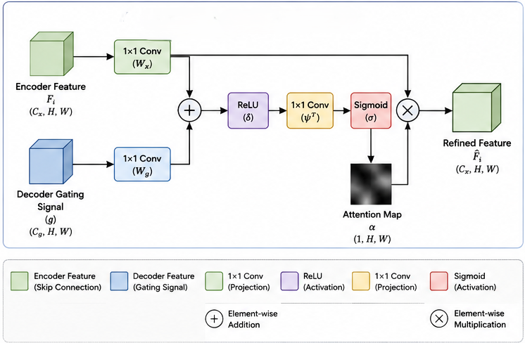

# HSegFormer

## Introduction

HSegFormer is a hybrid CNN–Transformer framework for brain tumor segmentation from contrast-enhanced T1-weighted MRI. The model combines the local representation capability of convolutional neural networks with the global contextual modeling of hierarchical vision transformers. To improve feature learning, HSegFormer incorporates multi-scale feature fusion, stage-wise attention-guided decoding, and deep supervision, while maintaining computational efficiency.

This repository contains the official implementation of the architecture presented in the accompanying manuscript.

---

## Method Overview

HSegFormer consists of four main components:

### 1. Hybrid Encoder
- Parallel **ResNet-50** and **SegFormer** backbones extract complementary local and global feature representations at multiple spatial resolutions.

### 2. Multi-scale Feature Fusion
- Features from both encoder branches are projected into a common embedding space, concatenated, and refined using the proposed **Normalization Attention Block (NABlock)** to produce hierarchical fused representations.

### 3. Attention-guided Decoder
- A coarse-to-fine decoder progressively reconstructs the segmentation map. At each decoding stage, **Attention Gates (At-G)** use the upsampled decoder feature as a gating signal to selectively refine the corresponding encoder skip feature before further refinement with NABlock.

### 4. Prediction Head
- An **Atrous Spatial Pyramid Pooling (ASPP)** module aggregates multi-scale contextual information, followed by a $1 \times 1$ convolution to generate the final binary segmentation mask.

---

## Overall Architecture

<p align="center">

</p>

---

## Normalization Attention Block (NABlock)

<p align="center">

</p>

The proposed **NABlock** is a lightweight feature refinement module that combines:

- Depthwise separable convolution
- Pointwise convolution
- Group Normalization
- GELU activation
- Squeeze-and-Excitation (SE) channel attention

This design enhances feature discrimination while introducing only a small computational overhead.

---

## Attention Gate (At-G)

<p align="center">

</p>

The proposed **Attention Gate (At-G)** selectively filters encoder skip features using the upsampled decoder feature as a gating signal. The refined features are then forwarded to the decoder, allowing the network to suppress irrelevant background responses while preserving informative tumor-related structures during progressive decoding.

---

## Repository Structure

```text
HSegFormer/
│
├── README.md
├── docs/
│   ├── Proposed.png
│   ├── NBlock.png
│   └── At_G.png
│
└── models/
    └── hsegformer_architecture.py
```

---

## Repository Contents

This repository currently provides:

- Source code of the HSegFormer architecture
- Architectural diagrams
- Documentation describing the proposed framework
---

## Paper

The manuscript is currently under review.
Citation information will be added after publication.
---

## Contact

Questions and feedback are welcome through the GitHub Issues page.
